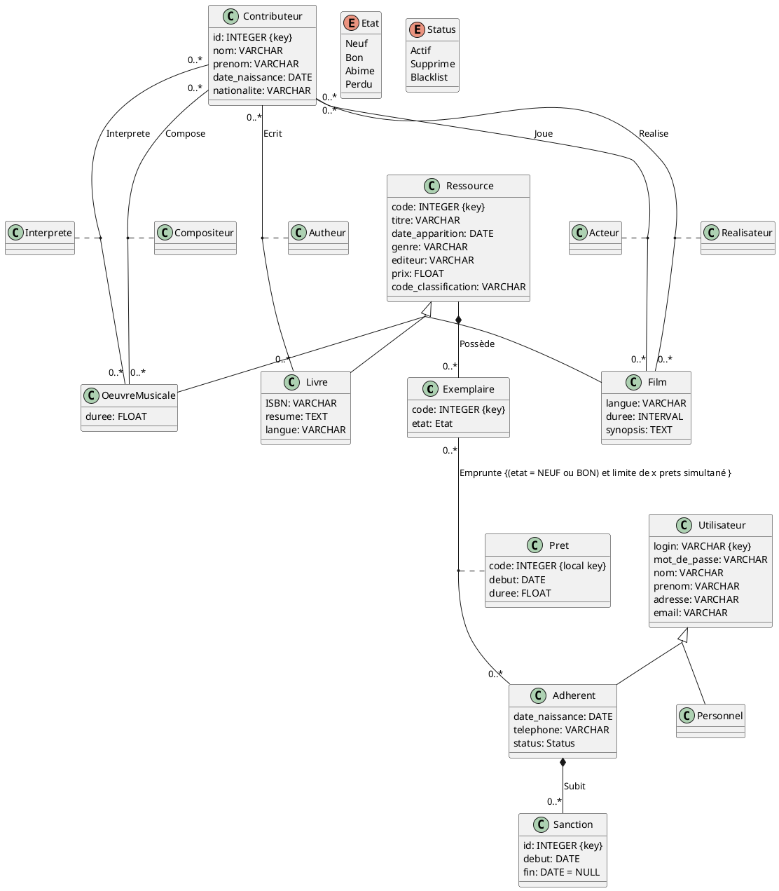

La génération marche pas toujours sur Gitlab, mais il existe un site 
pour générer des png à partir du code PlantUML : https://www.plantuml.com/plantuml/uml/

```plantuml
@startuml
skinparam groupInheritance 2


class Exemplaire {
code: INTEGER {key}
etat: Etat
}

class Ressource {
code: INTEGER {key}
titre: VARCHAR
date_apparition: DATE
genre: VARCHAR
editeur: VARCHAR
prix: FLOAT
code_classification: VARCHAR
}
enum Etat {
Neuf
Bon
Abime
Perdu
}
class Film {
langue: VARCHAR
duree: INTERVAL
synopsis: TEXT
}
class Livre {
ISBN: VARCHAR
resume: TEXT
langue: VARCHAR
}

class OeuvreMusicale {
duree: FLOAT
}


class Contributeur {
id: INTEGER {key}
nom: VARCHAR
prenom: VARCHAR
date_naissance: DATE
nationalite: VARCHAR
}

class Utilisateur {
login: VARCHAR {key}
mot_de_passe: VARCHAR
nom: VARCHAR
prenom: VARCHAR
adresse: VARCHAR
email: VARCHAR
}

class Personnel {

}

class Adherent {
date_naissance: DATE
telephone: VARCHAR
status: Status
}

enum Status {
Actif
Supprime
Blacklist
}
class Pret {
code: INTEGER {local key}
debut: DATE
duree: FLOAT
}

class Sanction {
id: INTEGER {key}
debut: DATE
fin: DATE = NULL
}

Ressource *-- "0..*" Exemplaire: Possède

Ressource <|-- Livre
Ressource <|-- OeuvreMusicale
Ressource <|-- Film

Utilisateur <|-- Personnel
Utilisateur <|-- Adherent

Adherent *-- "0..*" Sanction: Subit
Exemplaire "0..*" -- "0..*" Adherent: Emprunte {(etat = NEUF ou BON) et limite de x prets simultané }
(Exemplaire, Adherent) .. Pret

Contributeur "0..*" -- "0..*" Livre: Ecrit
(Contributeur, Livre) .. Autheur

Contributeur "0..*" -- "0..*" Film: Joue
(Contributeur, Film) .. Acteur
Contributeur "0..*" -- "0..*" Film: Realise
(Contributeur, Film) .. Realisateur


Contributeur "0..*" -- "0..*" OeuvreMusicale: Interprete
(Contributeur, OeuvreMusicale) .. Interprete
Contributeur "0..*" -- "0..*" OeuvreMusicale: Compose
(Contributeur, OeuvreMusicale) .. Compositeur
@enduml
@startuml
skinparam groupInheritance 2


class Exemplaire {
code: INTEGER {key}
etat: Etat
}

class Ressource {
code: INTEGER {key}
titre: VARCHAR
date_apparition: DATE
genre: VARCHAR
editeur: VARCHAR
prix: FLOAT
code_classification: VARCHAR
}
enum Etat {
Neuf
Bon
Abime
Perdu
}
class Film {
langue: VARCHAR
duree: INTERVAL
synopsis: TEXT
}
class Livre {
ISBN: VARCHAR
resume: TEXT
langue: VARCHAR
}

class OeuvreMusicale {
duree: FLOAT
}


class Contributeur {
id: INTEGER {key}
nom: VARCHAR
prenom: VARCHAR
date_naissance: DATE
nationalite: VARCHAR
}

class Utilisateur {
login: VARCHAR {key}
mot_de_passe: VARCHAR
nom: VARCHAR
prenom: VARCHAR
adresse: VARCHAR
email: VARCHAR
}

class Personnel {

}

class Adherent {
date_naissance: DATE
telephone: VARCHAR
status: Status
}

enum Status {
Actif
Supprime
Blacklist
}
class Pret {
code: INTEGER {local key}
debut: DATE
duree: FLOAT
}

class Sanction {
id: INTEGER {key}
debut: DATE
fin: DATE = NULL
}

Ressource *-- "0..*" Exemplaire: Possède

Ressource <|-- Livre
Ressource <|-- OeuvreMusicale
Ressource <|-- Film

Utilisateur <|-- Personnel
Utilisateur <|-- Adherent

Adherent *-- "0..*" Sanction: Subit
Exemplaire "0..*" -- "0..*" Adherent: Emprunte {(etat = NEUF ou BON) et limite de x prets simultané }
(Exemplaire, Adherent) .. Pret

Contributeur "0..*" -- "0..*" Livre: Ecrit
(Contributeur, Livre) .. Autheur

Contributeur "0..*" -- "0..*" Film: Joue
(Contributeur, Film) .. Acteur
Contributeur "0..*" -- "0..*" Film: Realise
(Contributeur, Film) .. Realisateur


Contributeur "0..*" -- "0..*" OeuvreMusicale: Interprete
(Contributeur, OeuvreMusicale) .. Interprete
Contributeur "0..*" -- "0..*" OeuvreMusicale: Compose
(Contributeur, OeuvreMusicale) .. Compositeur
@enduml
```
